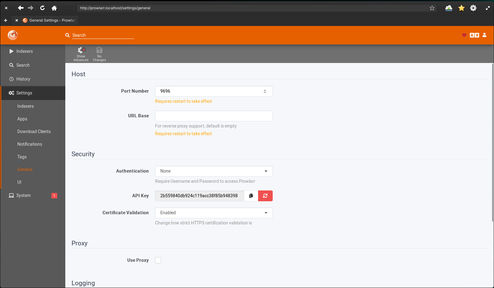

# Plex Home Media integrations

This package is created for those who are not experts in linux servers and docker. If you follow these steps you'll be able to install `Docker` and deploy some dockerized apps needed for you `Plex` home server. You just need a desktop computer with Ubuntu server installed on it. Follow all the steps and you should be fine.

I'm using the following apps, the images are provided by LSIO https://www.linuxserver.io/

1. Radarr (https://hub.docker.com/r/linuxserver/radarr)
2. Sonarr (https://hub.docker.com/r/linuxserver/sonarr)
3. Overseerr (https://hub.docker.com/r/linuxserver/overseerr)
4. Tautulli (https://hub.docker.com/r/linuxserver/tautulli)
5. Transmission (https://fleet.linuxserver.io/image?name=linuxserver/transmission)
6. Prowlarr (https://hub.docker.com/r/linuxserver/prowlarr)
7. Jackett (https://hub.docker.com/r/linuxserver/jackett)

The router part can be used for local access of the apps, if you wish to be accessible from the outside please wait until i finish the Traefik + Authelia implementation. The certs are generated by Let's Encrypt and i'm using HTTP challange, meaning you need to have port 80 accesible.
### Important router part.
Next update will bring a middleware service which will provide authentication to protect the services from unauthorized access if you wish to expose port 443 to WAN.

# Configure the integration.
Inside this repo you'll find a file names `env.mk`. Please edit this file with your volumes path. I recommend using `/appdata` if you have the hdd/ssd installed on your computer and `/sharedata` if you have attached a NFS share to your server. Also please update your user GID and UID.
Set your timezone by updateing `TIMEZONE` environment variable.
# Prepare server.
On your Ubuntu server you need to make sure you have already installed the following packages using aptitude.

```bash
sudo apt install -y wget make curl
```

## Install Docker
Install Docker and docker-compose. You can either manually run each line or just execute the make target from below:
```bash
make install
```

```bash
sudo curl https://get.docker.com | bash
sudo groupadd docker
sudo usermod -aG docker $USER

sudo curl -L "https://github.com/docker/compose/releases/download/1.29.2/docker-compose-$(uname -s)-$(uname -m)" -o /usr/local/bin/docker-compose
sudo chmod +x /usr/local/bin/docker-compose
sudo ln -s /usr/local/bin/docker-compose /usr/bin/docker-compose
```
**_NOTE:_** Here is a tricky part, because of this command `sudo usermod -aG docker $USER` you need to logout once from you server before you move forward.  

After you installed docker you get the chance to populate `/etc/hosts` with the services local domain name. These names can be used in your local browser to access the web interface of all service. The step should be used only if you have a GUI installed on your server, otherwise it has no use. Please use `sudo` command when running this `make` target.
```bash
sudo make prepare-hosts
```

## Install Plex
Install Plex by downloading the deb package.

```bash
wget https://downloads.plex.tv/plex-media-server-new/1.25.2.5319-c43dc0277/debian/plexmediaserver_1.25.2.5319-c43dc0277_amd64.deb
sudo dpkg -i plexmediaserver_1.25.2.5319-c43dc0277_amd64.deb
```

After you installed Plex you should configure it.

## Authelia config.

### Generating user password.
Run this command to generate a password for your user then replace it in the `users_database.yml`.
```bash
docker run authelia/authelia:latest authelia hash-password 'yourpassword'
```


# How to use the package.
This integration is making use of `make`. I have set up some targets to ease your job. I will describe each make target.

1. First run this from you CLI. This target will create the docker networks and volumes.
```bash
make prepare
```
  * If you want to remove the volumes and networks run:
  ```bash
  make clean
  ```
  * If you want to remove the network only:
  ```bash
  make network-clean
  ```
  * If you want to remove the volumes only. But be aware, this target will remove the mapped path too:
  ```bash
  make clean-volumes
  ```
2. To start the bundle run this. This will bring all the docker images online.
```bash
make start
```
  * If you want to preload the images on your server, also using this target from time to time will bring the latest docker image:
  ```bash
  make pull
  ```
  * If you want to stop the docker images.
  ```bash
  make stop
  ```

# Access services.
## Traefik service.
Open your browser and type `http://services.localhost/dashboard/`. This will give you an overview on the deployed services.


## Sonarr service.
Open your broser and type `http://sonarr.localhost`. You can start setup on this service. You should see a page like this:


## Radarr service.
Open your broser and type `http://radarr.localhost`. You can start setup on this service. You should see a page like this:


## Prowlarr service.
Open your broser and type `http://prowlarr.localhost`. You can start setup on this service. You should see a page like this:


## Transmission service.
Open your broser and type `http://transmission.localhost`. You can start setup on this service. You should see a page like this:


## Tautulli service.
Open your broser and type `http://tautulli.localhost`. You can start setup on this service. You should see a page like this:


## Jackett service.
Open your broser and type `http://jackett.localhost`. You can start setup on this service. You should see a page like this:


## Overseerr service.
Open your broser and type `http://overseerr.localhost`. You can start setup on this service. You should see a page like this:


